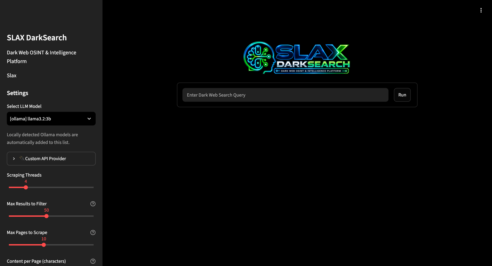

<p align="center">
  
</p>

<h1 align="center">SLAX DarkSearch</h1>

<p align="center"><strong>Dark Web OSINT & Intelligence Platform</strong></p>

<p align="center">
Tor • OSINT • AI • PostgreSQL • Intelligence • Docker
</p>

---

## Overview

**SLAX DarkSearch** is a Dark Web OSINT and intelligence platform designed to search, aggregate, persist, correlate, and analyze information obtained from Tor-accessible resources.

The platform combines:

- Tor network access
- Multiple search-engine aggregation
- Parallel search execution
- Onion result discovery
- Result normalization and deduplication
- AI/LLM-assisted analysis
- PostgreSQL intelligence persistence
- Search-run lifecycle tracking
- Historical onion observations
- Visibility/ranking analytics
- Investigation persistence
- Operational health monitoring
- Streamlit web interface
- Docker-based deployment

SLAX DarkSearch extends the open-source **Robin** project with an additional intelligence/persistence layer, operational monitoring, SLAX-specific functionality, and branding.

> **Attribution:** This project is derived from and extends Robin. The upstream copyright notice and MIT license are preserved in `LICENSE`.

---

## User Interface

The SLAX DarkSearch web interface provides a centralized environment for Dark Web OSINT investigations, including search execution, LLM selection, scraping configuration and operational monitoring.

<p align="center">
  
</p>

---

## Architecture

```text
                         USER / ANALYST
                               |
                               | HTTP :8501
                               v
                 +-----------------------------+
                 |      SLAX DarkSearch        |
                 |       Streamlit UI          |
                 +--------------+--------------+
                                |
             +------------------+-------------------+
             |                  |                   |
             v                  v                   v
      +-------------+    +-------------+     +-------------+
      | Search Layer|    | AI / LLM    |     |Health Layer |
      +------+------+    +------+------+     +------+------+
             |                  |                   |
             v                  v                   |
      +-------------+    +-------------+            |
      | Tor SOCKS5  |    |   Ollama /  |            |
      +------+------+    | LLM Provider|            |
             |           +-------------+            |
             v                                      |
      +-------------+                               |
      | Tor Network |                               |
      +------+------+                               |
             |                                      |
             v                                      |
   +-----------------------+                        |
   | Search Engines /      |                        |
   | Tor Resources         |                        |
   +-----------+-----------+                        |
               |                                    |
               +----------------+-------------------+
                                |
                                v
                    +-----------------------+
                    |  Intelligence Layer   |
                    | intelligence_db.py    |
                    +-----------+-----------+
                                |
                                v
                    +-----------------------+
                    |      PostgreSQL       |
                    | DB: slaxsecurity      |
                    | Schema: robin         |
                    +-----------------------+
```

### Container topology

A typical deployment uses:

```text
Docker Host
|
+-- robin
|   +-- Streamlit UI
|   +-- Search orchestration
|   +-- Tor client/proxy
|   +-- Health checks
|   +-- Intelligence integration
|
+-- slax-postgres
|   +-- PostgreSQL
|   +-- database: slaxsecurity
|   +-- schema: robin
|
+-- Ollama / external LLM endpoint
|
+-- Docker network: slax-security
```

The application container communicates with PostgreSQL over the Docker network.

---

## Search lifecycle

```text
Search submitted
      |
      v
start_search_run()
      |
      v
Parallel engine queries
      |
      v
Raw results
      |
      v
record_observation()
      |
      v
Normalization / deduplication
      |
      +-------------------------+
      |                         |
      v                         v
   Success                    Failure
      |                         |
      v                         v
finish_search_run()       fail_search_run()
```

This provides an auditable distinction between completed and failed executions.

---

## Core Components

### `ui.py`

Streamlit user interface.

Responsibilities include:

- Search input
- Search configuration
- LLM/model selection
- Investigation presentation
- System-status display
- SLAX DarkSearch branding

The application is normally exposed on TCP port `8501`.

### `search.py`

Search orchestration layer.

Responsibilities include:

- Multiple search-engine execution
- Concurrent workers
- Result aggregation
- Onion URL handling
- Normalization
- Duplicate filtering
- Search-run lifecycle integration
- Observation persistence

### `intelligence_db.py`

PostgreSQL intelligence integration.

Important functions currently include:

```python
get_connection()
start_search_run()
finish_search_run()
fail_search_run()
record_observation()
```

Database credentials are loaded from environment variables rather than being embedded in source code.

### `health.py`

Operational health-check subsystem.

Current checks include:

- Tor SOCKS proxy
- PostgreSQL
- LLM/provider
- Search engines

The Streamlit sidebar exposes these diagnostics through the **SYSTEM STATUS** area.

### `llm.py`

LLM integration and analysis layer.

The environment may use a local Ollama service or supported external providers when configured. A local model can keep the LLM processing path within the operator-controlled environment.

---

## PostgreSQL Intelligence Model

The current deployment uses:

```text
Database: slaxsecurity
Schema:   robin
```

### `robin.search_runs`

Tracks logical search executions.

Observed fields include:

```text
id
search_query
status
result_count
started_at
finished_at
```

Current lifecycle states:

```text
running
completed
failed
```

### `robin.onion_observations`

Stores individual observations associated with search runs, allowing the platform to retain which query, engine, and execution observed an onion service.

This enables questions such as:

- When was an address first observed?
- When was it last observed?
- Which search engine returned it?
- Which run discovered it?
- How often has it appeared?
- Was it returned by multiple engines?

### `robin.onion_services`

Maintains accumulated information about discovered onion services.

### Visibility ranking

The environment also implements an onion visibility-ranking view based on completed search runs. The current ranking concept uses signals such as:

- Number of search engines observing an onion
- Number of distinct queries
- Number of distinct completed runs
- Observation history

A visibility score is an analytical indicator of how broadly a service appears in collected search data. It should not be interpreted as a trust, safety, legitimacy, or reputation score.

---

## Repository Layout

```text
slaxdarksearch/
|
+-- .gitignore
+-- Dockerfile.slax
+-- LICENSE
+-- README.md
+-- health.py
+-- intelligence_db.py
+-- llm.py
+-- search.py
+-- ui.py
+-- slax_black.png
```

Local/runtime files should remain excluded from Git, including secrets and investigation data.

Recommended `.gitignore` entries:

```gitignore
.env
*.before_*
*.backup
*.original
__pycache__/
*.pyc
investigations/
README.original.md
```

---

# Deployment Guide

## 1. Prerequisites

Recommended host:

- Linux
- Docker Engine
- Git
- Network access required by the selected LLM configuration
- Sufficient storage for PostgreSQL and investigation data

Verify Docker and Git:

```bash
docker --version
git --version
```

---

## 2. Clone the repository

Using SSH:

```bash
git clone git@github.com:leandroslax/slaxdarksearch.git
cd slaxdarksearch
```

Or configure the repository according to your organization's Git authentication policy.

---

## 3. Environment configuration

Create a local `.env` file. **Never commit the real `.env` file.**

The current database integration expects variables in this form:

```dotenv
ROBIN_DB_HOST=slax-postgres
ROBIN_DB_PORT=5432
ROBIN_DB_NAME=slaxsecurity
ROBIN_DB_USER=slax
ROBIN_DB_PASSWORD=CHANGE_ME
```

Depending on the selected LLM provider, additional provider-specific environment variables may be required.

Examples referenced by the application include:

```dotenv
OPENAI_API_KEY=
ANTHROPIC_API_KEY=
GOOGLE_API_KEY=
OPENROUTER_API_KEY=
```

Only configure providers you actually use.

For production environments, prefer a dedicated secret-management mechanism rather than distributing plaintext `.env` files.

---

## 4. Docker network

Create the application network if it does not already exist:

```bash
docker network create slax-security
```

If Docker reports that it already exists, no additional action is required.

Verify:

```bash
docker network ls | grep slax-security
```

---

## 5. PostgreSQL

The SLAX intelligence layer requires a PostgreSQL instance reachable by the application.

The reference environment uses:

```text
Container: slax-postgres
Database:  slaxsecurity
Schema:    robin
```

A minimal PostgreSQL container can be created separately, but the exact database DDL used by your deployed version should be maintained as a migration/schema file before treating the repository as fully reproducible.

Example container skeleton:

```bash
docker run -d \
  --name slax-postgres \
  --restart unless-stopped \
  --network slax-security \
  -e POSTGRES_USER=slax \
  -e POSTGRES_PASSWORD='CHANGE_ME' \
  -e POSTGRES_DB=slaxsecurity \
  -v slax-postgres-data:/var/lib/postgresql/data \
  postgres:16-alpine
```

Do not use `CHANGE_ME` outside a disposable test environment.

Test PostgreSQL:

```bash
docker exec slax-postgres \
  psql -U slax -d slaxsecurity -c "SELECT version();"
```

### Important replication note

The Python source alone is not sufficient to reconstruct an existing intelligence database. For deterministic deployment, export and version the required **schema-only DDL/migrations** for:

- `robin.search_runs`
- `robin.onion_services`
- `robin.onion_observations`
- indexes
- constraints
- ranking views

Do not publish production data or credentials with those schema files.

---

## 6. Build SLAX DarkSearch

The current custom image is built using `Dockerfile.slax`.

```bash
cd slaxdarksearch

docker build \
  -f Dockerfile.slax \
  -t robin-slax:1.1 .
```

Verify:

```bash
docker image inspect robin-slax:1.1 >/dev/null \
  && echo "IMAGE: OK"
```

---

## 7. Start the application

The reference environment currently starts the application with bind mounts for locally maintained components:

```bash
docker run -d \
  --name robin \
  --restart unless-stopped \
  --add-host=host.docker.internal:host-gateway \
  -p 8501:8501 \
  -v "$PWD/.env:/app/.env" \
  -v "$PWD/investigations:/app/investigations" \
  -v "$PWD/llm.py:/app/llm.py:ro" \
  -v "$PWD/search.py:/app/search.py:ro" \
  -v "$PWD/ui.py:/app/ui.py:ro" \
  -v "$PWD/slax_black.png:/app/slax_black.png:ro" \
  robin-slax:1.1
```

Attach it to the database network:

```bash
docker network connect slax-security robin
```

If the container is already created on that network, Docker may report that the endpoint already exists.

---

## 8. Verify Tor bootstrap

Inspect Tor bootstrap messages:

```bash
docker logs robin 2>&1 | grep "Bootstrapped"
```

A healthy bootstrap eventually reaches:

```text
Bootstrapped 100% (done): Done
```

This confirms that Tor completed bootstrap. It does not by itself guarantee that every external onion service or search engine is reachable.

---

## 9. Verify the intelligence integration

```bash
docker exec -i robin python - <<'PY'
import search
import intelligence_db

print("record_observation:", bool(search.record_observation))
print("start_search_run:", bool(search.start_search_run))
print("finish_search_run:", bool(search.finish_search_run))
print("fail_search_run:", bool(search.fail_search_run))
print("intelligence_db:", intelligence_db.__file__)

assert search.record_observation
assert search.start_search_run
assert search.finish_search_run
assert search.fail_search_run

print("SLAX DARKSEARCH INTELLIGENCE: READY")
PY
```

---

## 10. Verify PostgreSQL from the application

```bash
docker exec -i robin python - <<'PY'
from health import check_postgres
print(check_postgres())
PY
```

Expected healthy shape:

```text
{'status': 'up', 'latency_ms': <value>, 'error': None}
```

---

## 11. Access the Web UI

Open:

```text
http://SERVER_IP:8501
```

For the reference environment this service is mapped through Docker port `8501`.

For Internet-facing deployments, do not expose a development-style Streamlit service directly without appropriate network controls, authentication strategy, TLS/reverse proxying, patch management, and access restrictions.

---

# Validation

## Python syntax

```bash
python3 -m py_compile \
  health.py \
  intelligence_db.py \
  llm.py \
  search.py \
  ui.py
```

Container-side validation:

```bash
docker exec robin python -m py_compile \
  /app/health.py \
  /app/intelligence_db.py \
  /app/llm.py \
  /app/search.py \
  /app/ui.py
```

---

## Search-run functional test

A normal search should create a new run and eventually mark it `completed`.

Example:

```bash
docker exec -i robin python - <<'PY'
from search import get_search_results

print("Starting search...")
results = get_search_results("privacy", max_workers=5)
print("Final results:", len(results))
PY
```

Inspect recent executions:

```bash
docker exec slax-postgres \
  psql -U slax -d slaxsecurity \
  -c "
SELECT
    id,
    search_query,
    status,
    result_count,
    started_at,
    finished_at
FROM robin.search_runs
ORDER BY id DESC
LIMIT 10;
"
```

---

## Search-run correlation

```bash
docker exec slax-postgres \
  psql -U slax -d slaxsecurity \
  -c "
WITH last_run AS (
    SELECT MAX(id) AS id
    FROM robin.search_runs
)
SELECT
    r.id,
    r.search_query,
    r.status,
    r.result_count,
    COUNT(o.id) AS observations,
    COUNT(DISTINCT o.onion_address) AS unique_onions,
    COUNT(DISTINCT o.search_engine) AS engines
FROM robin.search_runs r
JOIN last_run lr
  ON lr.id = r.id
LEFT JOIN robin.onion_observations o
  ON o.search_run_id = r.id
GROUP BY
    r.id,
    r.search_query,
    r.status,
    r.result_count;
"
```

`result_count`, observations, and unique onion counts are different metrics and are not expected to always be identical.

---

# System Status

The Streamlit sidebar provides a **SYSTEM STATUS** panel.

The current design can inspect:

```text
Tor
PostgreSQL
LLM
Search Engines
SLAX Web UI
```

The PostgreSQL health check performs a lightweight `SELECT 1` through the same database integration used by the application.

The Tor health check verifies whether the expected local SOCKS proxy is accepting connections.

Health indicators are operational signals, not security guarantees.

---

# Local AI / Ollama

SLAX DarkSearch can be integrated with a locally hosted Ollama runtime.

A typical logical topology is:

```text
SLAX DarkSearch
       |
       | API
       v
    Ollama
       |
       v
 Local LLM
```

Verify an Ollama installation/container according to your deployment method, then ensure the endpoint expected by `llm.py` is reachable from the `robin` container.

When Ollama runs on the Docker host, the current application container includes:

```text
host.docker.internal -> host-gateway
```

through:

```bash
--add-host=host.docker.internal:host-gateway
```

This can be used when the configured LLM endpoint targets a service on the Docker host.

---

# Persistence and Backups

## PostgreSQL

The intelligence database is persistent operational data and should be backed up separately from the application source.

Example logical backup:

```bash
docker exec slax-postgres \
  pg_dump -U slax -d slaxsecurity \
  > slaxsecurity_$(date +%Y%m%d_%H%M%S).sql
```

Store backups outside the application repository.

### Schema-only export

For reproducible deployments:

```bash
docker exec slax-postgres \
  pg_dump -U slax -d slaxsecurity \
  --schema=robin \
  --schema-only \
  > robin_schema.sql
```

Review generated DDL before publishing it.

## Investigations

The reference deployment bind-mounts:

```text
./investigations -> /app/investigations
```

Treat investigation files as potentially sensitive operational data. They are excluded from Git by default and should have their own retention and backup policy.

---

# Security Recommendations

SLAX DarkSearch deals with untrusted Internet/Tor content. Operate it as an analysis system rather than as a trusted-content environment.

Recommended controls include:

- Keep `.env` out of Git
- Never commit API keys or passwords
- Use unique database credentials
- Restrict PostgreSQL network exposure
- Avoid publishing investigation data
- Keep Docker and the host patched
- Limit access to TCP/8501
- Prefer a reverse proxy with TLS for remote access
- Authenticate remote users
- Back up PostgreSQL
- Rotate exposed credentials immediately
- Treat discovered URLs and content as untrusted
- Avoid executing downloaded content
- Use least-privilege service accounts
- Review logs before sharing them publicly

### Secret scan before commits

A simple preliminary check:

```bash
grep -RniE \
'password|passwd|secret|api[_-]?key|token' \
Dockerfile.slax health.py intelligence_db.py llm.py search.py ui.py \
2>/dev/null
```

Matches do not necessarily indicate leaked credentials; variable names and validation code will also match. Review the actual values before committing.

Also verify:

```bash
git check-ignore -v .env
git status
```

---

# Troubleshooting

## Tor does not reach 100%

Inspect logs:

```bash
docker logs robin 2>&1 | grep -iE \
'tor|bootstrap|error|warn|fail'
```

Check the container:

```bash
docker ps --filter name=robin
```

Check Tor proxy health from the application:

```bash
docker exec -i robin python - <<'PY'
from health import check_tor_proxy
print(check_tor_proxy())
PY
```

---

## PostgreSQL is unavailable

Check containers:

```bash
docker ps
```

Check the Docker network:

```bash
docker network inspect slax-security
```

Test PostgreSQL directly:

```bash
docker exec slax-postgres \
  psql -U slax -d slaxsecurity -c "SELECT 1;"
```

Test through SLAX DarkSearch:

```bash
docker exec -i robin python - <<'PY'
from health import check_postgres
print(check_postgres())
PY
```

---

## Intelligence integration is unavailable

Check imports:

```bash
docker exec -i robin python - <<'PY'
from intelligence_db import (
    get_connection,
    start_search_run,
    finish_search_run,
    fail_search_run,
    record_observation,
)

print("get_connection: OK")
print("start_search_run: OK")
print("finish_search_run: OK")
print("fail_search_run: OK")
print("record_observation: OK")
PY
```

Inspect the actual module:

```bash
docker exec robin python - <<'PY'
import intelligence_db
print(intelligence_db.__file__)
PY
```

---

## Host file differs from container file

Inspect bind mounts:

```bash
docker inspect robin --format \
'{{range .Mounts}}{{println .Source "->" .Destination "TYPE=" .Type}}{{end}}'
```

Compare relevant content:

```bash
grep -n "SLAX DarkSearch" ~/robin/ui.py
docker exec robin grep -n "SLAX DarkSearch" /app/ui.py
```

A container restart may be required after changing mounted application files:

```bash
docker restart robin
```

---

## Python syntax error

Host:

```bash
python3 -m py_compile ~/robin/search.py
```

Container:

```bash
docker exec robin python -m py_compile /app/search.py
```

If the host succeeds but the container fails, compare the files and verify the bind mount.

---

# Replicating to Another Environment

A clean migration should transfer **configuration structure and schema**, not secrets.

Recommended process:

```text
1. Prepare Linux host
2. Install Docker and Git
3. Clone SLAX DarkSearch
4. Create .env locally
5. Create Docker network
6. Deploy PostgreSQL
7. Apply/version database schema
8. Build robin-slax image
9. Configure Ollama or selected LLM provider
10. Start SLAX DarkSearch
11. Connect containers to slax-security
12. Verify Tor bootstrap
13. Verify PostgreSQL
14. Verify intelligence imports
15. Execute controlled search test
16. Validate search_runs
17. Configure backups
18. Configure network/access controls
```

For a production-grade reproducible deployment, consider adding:

```text
docker-compose.yml / compose.yaml
.env.example
database migrations
schema SQL
healthchecks
versioned release tags
CI validation
dependency pinning
backup/restore documentation
```

These artifacts reduce manual deployment differences between environments.

---

# Updating the Application

Before updating:

```bash
cd ~/robin
git status
```

Commit or safely preserve local modifications.

Pull changes:

```bash
git pull --ff-only
```

Rebuild when the image contents or dependencies change:

```bash
docker build \
  -f Dockerfile.slax \
  -t robin-slax:1.1 .
```

Recreate the application container as required by the deployment.

Database schema changes should be handled through explicit migrations rather than ad-hoc production edits whenever possible.

---

# Git Workflow

Check changes:

```bash
git status
git diff
```

Stage:

```bash
git add README.md
```

Commit:

```bash
git commit -m "Add complete SLAX DarkSearch documentation"
```

Push:

```bash
git push -u origin main
```

The repository remote can be configured with SSH:

```bash
git remote set-url origin \
  git@github.com:leandroslax/slaxdarksearch.git
```

Verify:

```bash
git remote -v
ssh -T git@github.com
```

---

# Responsible Use

SLAX DarkSearch is intended for legitimate OSINT, research, defensive security, threat intelligence, and authorized investigative workflows.

Tor resources may contain illegal, malicious, deceptive, disturbing, or otherwise unsafe material. Operators are responsible for:

- complying with applicable law;
- respecting authorization boundaries;
- protecting collected information;
- avoiding execution of untrusted content;
- maintaining appropriate evidence/data-handling procedures;
- applying organizational security policies.

Discovery of a resource does not imply that SLAX, the upstream project, or its contributors endorse or verify that resource.

---

# Upstream Attribution

SLAX DarkSearch is based on and extends the open-source **Robin** project.

The repository retains the upstream MIT license and copyright notice:

```text
Copyright (c) 2025 Apurv Singh Gautam
```

The MIT license permits use, modification, distribution, sublicensing, and sale subject to its license conditions, including preservation of the copyright and permission notice in copies or substantial portions of the software.

See:

```text
LICENSE
```

for the complete license text.

SLAX-specific modifications, integrations, branding, deployment configuration, and intelligence-layer additions should be documented separately from the upstream attribution.

---

# Current Project Status

The current SLAX environment has validated:

- SLAX DarkSearch Streamlit branding
- Tor bootstrap to 100%
- PostgreSQL connectivity
- Search-run creation
- Completed-run tracking
- Failed-run tracking
- Onion observation persistence
- Multi-engine observations
- Search result deduplication
- Intelligence integration inside the application container
- PostgreSQL health monitoring
- Sidebar system-status integration
- Docker image `robin-slax:1.1`
- SSH-based GitHub authentication

---

# License

This repository contains software derived from an MIT-licensed upstream project.

See [`LICENSE`](./LICENSE) for the applicable license notice and terms.

---

<p align="center">
  <strong>SLAX DarkSearch</strong><br>
  Dark Web OSINT & Intelligence Platform<br>
  SLAX
</p>
